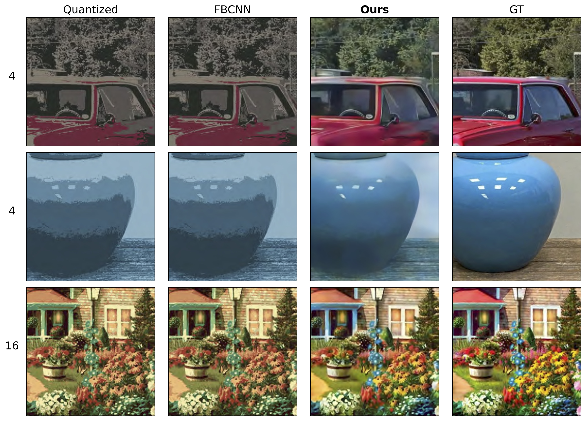
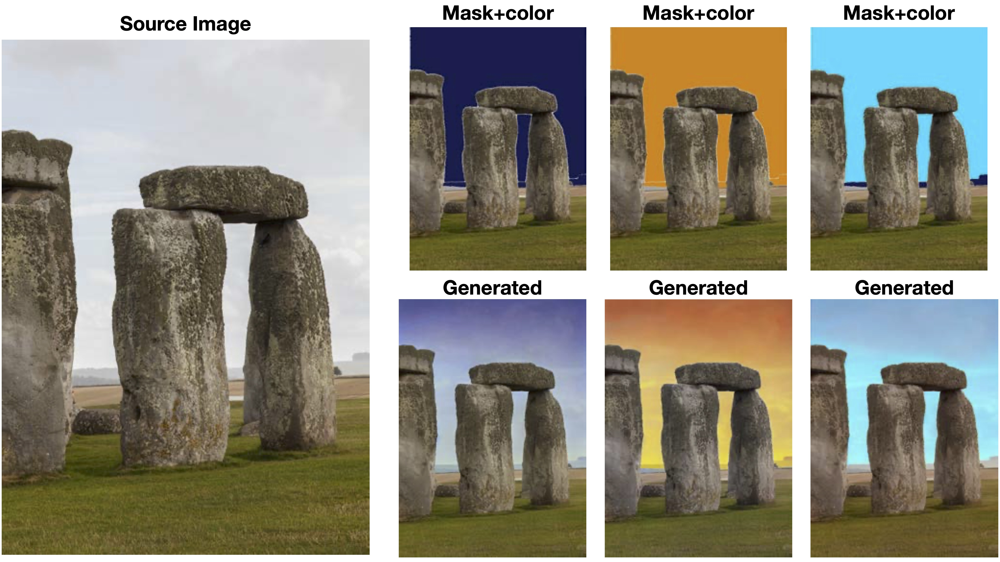

# Dequantization and Color Transfer with Diffusion Models

<p align="center">
  
</p>

We demonstrate an image dequantizing diffusion model that enables novel edits on natural images. We propose operating on quantized images because they offer easy abstraction for patch-based edits and palette transfer. In particular, we show that color palettes can make the output of the diffusion model easier to control and interpret. We first establish that existing image restoration methods are not sufficient, such as JPEG noise reduction models. We then demonstrate that our model can generate natural images that respect the color palette the user asked for. For palette transfer, we propose a method based on weighted bipartite matching. We then show that our model generates plausible images even after extreme palette transfers, respecting user query. Our method can optionally condition on the source texture in part or all of the image. In doing so, we overcome a common problem in existing image colorization methods that are unable to produce colors with a different luminance than the input. We evaluate several possibilities for texture conditioning and their trade-offs, including luminance, image gradients, and thresholded gradients, the latter of which performed best in maintaining texture and color control simultaneously. Our method can be usefully extended to another practical edit: recoloring patches of an image while respecting the source texture. Our procedure is supported by several qualitative and quantitative evaluations.

Presented at *WACV 2025* [*Link to paper*](https://openaccess.thecvf.com/content/WACV2025/html/Vavilala_Dequantization_and_Color_Transfer_with_Diffusion_Models_WACV_2025_paper.html)

[*Video Summary*](https://youtu.be/VDswgoQQx-Y?si=lHp8dXyww4oTlQx5)

## Building an Environment
- Please consult [*DeepFloyd IF*](https://github.com/deep-floyd/IF), from which this code heavily borrows.
- We were able to build a working environment as follows:
```shell
conda create -n palette python=3.11 -y
conda activate palette
pip install torch==2.5.1 torchvision==0.20.1 torchaudio==2.5.1 --index-url https://download.pytorch.org/whl/cu124
pip install tqdm numpy omegaconf matplotlib Pillow huggingface_hub transformers accelerate diffusers tokenizers sentencepiece ftfy beautifulsoup4
pip install git+https://github.com/openai/CLIP.git --no-deps
pip install configargparse piq opencv-python scikit-image
```
- If training from scratch, you'll want to download the base diffusion model first:
```shell
from huggingface_hub import snapshot_download
snapshot_download("deepfloyd/IF-II-M-v1.0")
```

## Training and Inference
- Toggle between different conditioning by setting the `--data_mode` flag. `T` for thresholded gradient, `L` for luminance, `G` for gradient conditioning.
- At test time (and during validation), several forms of evaluation can be run, which can be set via the `--tests` flag.
- **Training command:**

```shell
python run_palette.py --doCN --logdir logs/ --data_mode="T" --max_val_img=20 --tests="mprth" --seed=1 --paths "/path/to/images/*.jpg" --amp
```
- To run **inference** add the `--eval` flag and set the `--model_load_path` to the path of a checkpoint.

## Pretrained Models
- We provide models trained on limited compute [*here*](https://uofi.app.box.com/s/v3twnv3p4kqy4a4b710vh1o204j6x6sf). 

## Interactive Demo
- We provide 2 interactive demo scripts: ```color.py``` for palette transferring and ```segment.py``` for object recoloring.
- To use scripts with default settings simply run ```python color.py``` and ```python segment.py --share --server_port 8080``` 

## Example Images: Palette Transfer
<p align="center">
  
</p>

## Example Images: Color-Conditioned Inpainting
<p align="center">
  
</p>


## Citation
If you find this work helpful in your research, please consider citing our paper:

```shell
@InProceedings{Vavilala_2025_WACV,
    author    = {Vavilala, Vaibhav and Shaik, Faaris and Forsyth, David},
    title     = {Dequantization and Color Transfer with Diffusion Models},
    booktitle = {Proceedings of the Winter Conference on Applications of Computer Vision (WACV)},
    month     = {February},
    year      = {2025},
    pages     = {9612-9621}
}
